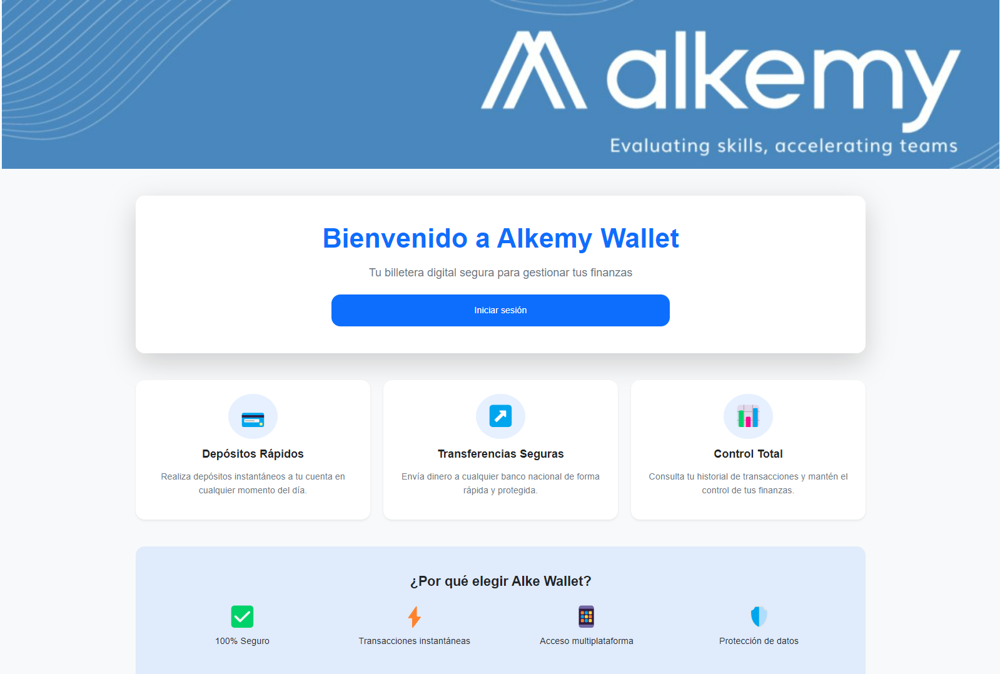
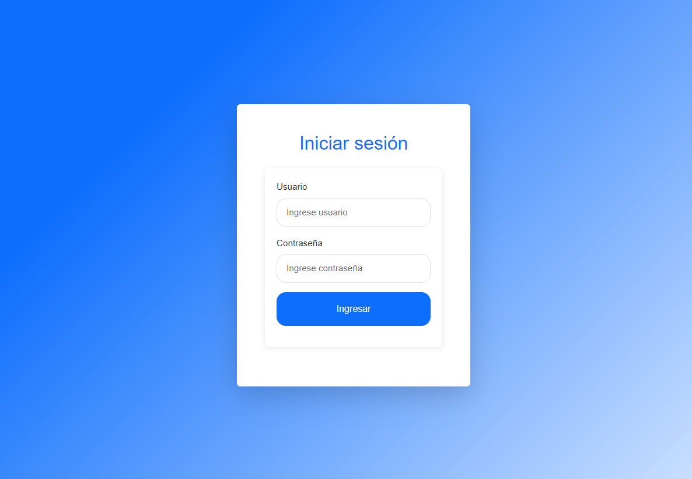
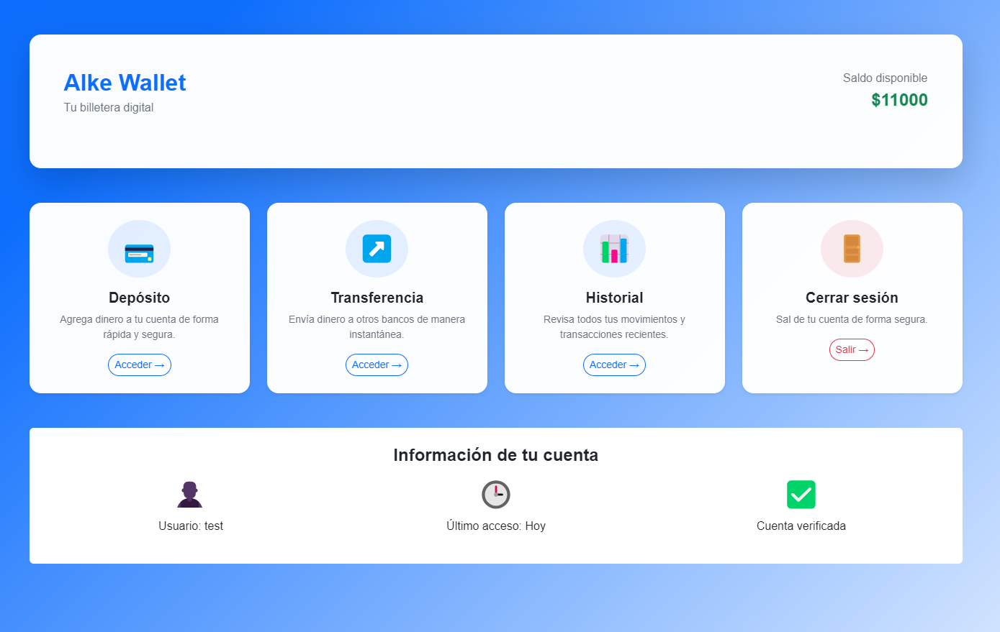
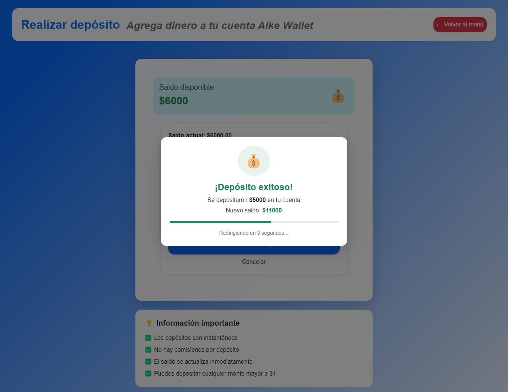
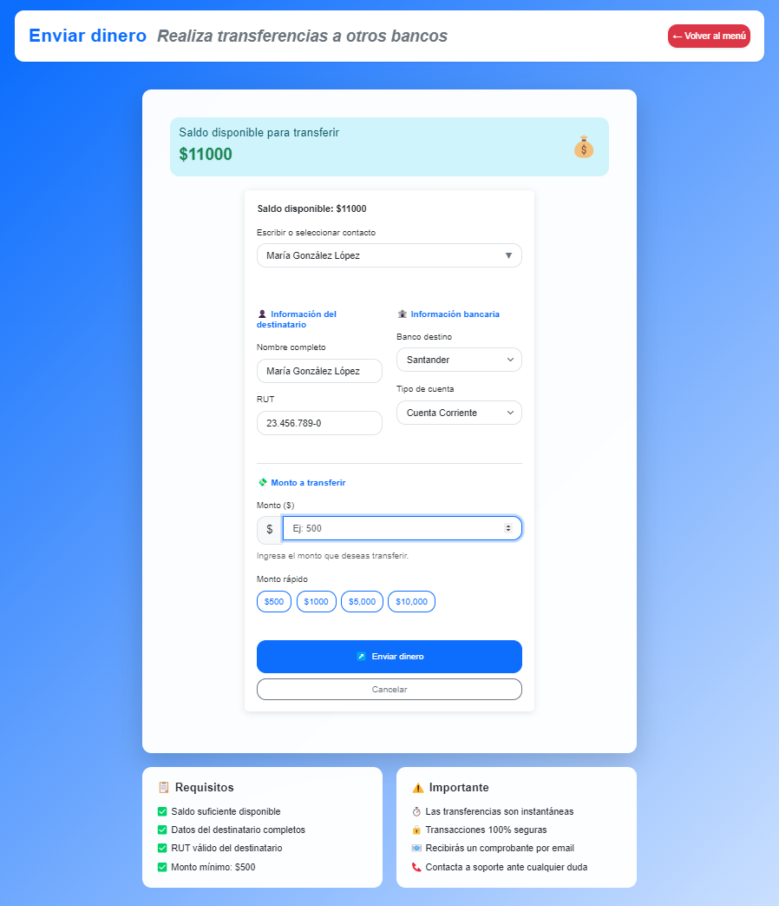
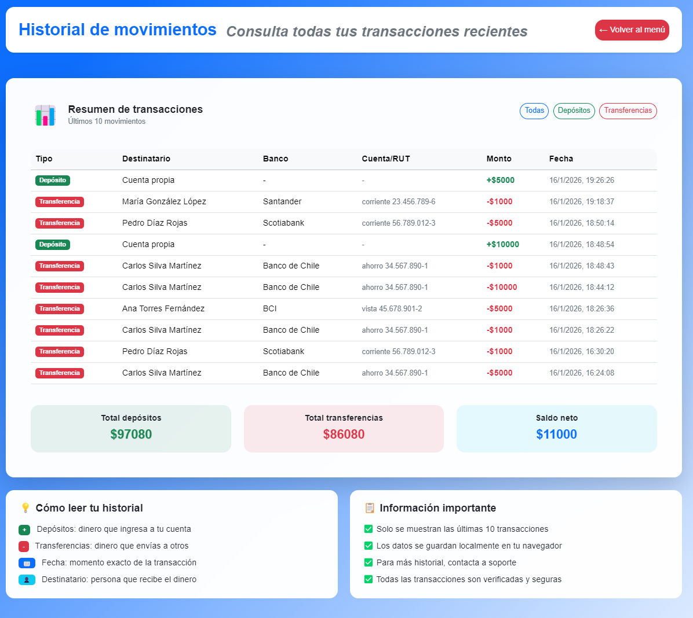

**Alke Wallet - Sistema de Billetera Digital**

**Descripción del Proyecto:**

Alke Wallet es una aplicación web de billetera digital desarrollada como parte del Bootcamp de Fullstack Python Developer de Alkemy Labs. El proyecto implementa un sistema completo para la gestión de activos financieros digitales, permitiendo a los usuarios realizar operaciones bancarias básicas de manera segura y eficiente.

**Objetivo Principal:**
Desarrollar una vista funcional, segura y fácil de usar que proporcione a los usuarios una solución confiable para administrar sus activos financieros de manera digital.

    NOTA: las credenciales pre definidas están al final de este documento (buscar "credenciales")

Arquitectura del Proyecto
Estructura de Carpetas

    alke-wallet/
    ├── index.html              # Página principal de bienvenida
    ├── login.html              # Autenticación de usuarios
    ├── menu.html               # Menú principal de operaciones
    ├── deposit.html            # Formulario de depósitos
    ├── sendmoney.html          # Transferencias a terceros
    ├── transactions.html       # Historial de transacciones
    |
    ├── js/
    │   ├── global.js           # Funciones globales y animaciones
    │   ├── login.js            # Validación de credenciales
    │   ├── menu.js             # Lógica del menú principal
    │   ├── deposit.js          # Procesamiento de depósitos
    │   ├── sendmoney.js        # Gestión de transferencias
    │   └── transactions.js     # Visualización de historial
    |
    ├── styles/
    │   └── styles.css          # Estilos personalizados
    |
    └── media/
        ├── sc1.png            # Captura pantalla login
        ├── sc2.png            # Captura pantalla menú
        ├── sc3.png            # Captura pantalla depósito
        ├── sc4.png            # Captura pantalla transferencia
        ├── sc5.png            # Captura pantalla historial
        ├── sc6.png            # Captura pantalla éxito
        └── wall.jpg           # Imagen de fondo

**Pantallas del Sistema**

**1. Página de Inicio (
index.html
)**
<html> </img></html>

* Presentación de la aplicación

* Características principales

* Botón de acceso al login

**2. Login (login.html)**
<html> </img></html>

* Formulario de autenticación
* Validación de credenciales
* Manejo de múltiples usuarios
* Redirección al menú principal

**3. Menú Principal (
menu.html
)**
<html> </img></html>

* Dashboard con saldo actual
* Accesos rápidos a funcionalidades
* Tarjetas interactivas
* Animaciones de hover

**4. Depósito (
deposit.html
)**
<html> </img></html>

* Formulario de ingreso de fondos
* Botones de montos rápidos
* Modal de confirmación con cuenta regresiva
* Actualización automática de saldo

**5. Transferencia (
sendmoney.html
)**

<html> </img></html>

* Sistema de búsqueda de contactos
* Validación de RUT chileno
* Formateo automático de campos
* Modal de error/éxito
* Barra de progreso para redirección

**6. Historial (
transactions.html
)**
<html> </img></html>

* Tabla de transacciones recientes
* Filtros por tipo de operación
* Resumen financiero

**Funcionalidades Implementadas**
1. Autenticación y Seguridad:

* Sistema de login con múltiples usuarios
* Validación de credenciales en cliente
* Persistencia de sesión con localStorage
* Datos separados por usuario

2. Gestión de Fondos:

* Visualización de saldo en tiempo real
* Depósitos instantáneos con modal de confirmación
* Transferencias con validación de saldo
* Historial completo de transacciones

3. Gestión de Contactos:

* Sistema de contactos predefinidos
* Campo combinado (combobox) para búsqueda/selección
* Autocompletado inteligente por nombre, RUT o banco
* Formulario de transferencia con autocompletado

4. Validaciones Avanzadas

* Validación de RUT chileno con algoritmo oficial
* Formateo automático de RUT (12.345.678-9)
* Validación de saldo suficiente
* Validación de campos obligatorios

**Interfaz de Usuario**

* Diseño Responsivo
Implementado con Bootstrap 5.3
* Diseño adaptable a móviles, tablets y desktop
* Paleta de colores corporativa (#0d6efd - azul fintech)
* Animaciones suaves y transiciones

**Componentes Principales**

* Cards para agrupar información
* Modals para confirmaciones y errores
* Formularios con validación visual
* Progress bars para indicar redirecciones
* List groups para resultados de búsqueda

**Tecnologías Utilizadas**

Frontend

    HTML5: Estructura semántica
    CSS3: Estilos personalizados y animaciones
    JavaScript (ES6): Lógica de aplicación
    jQuery 3.7.1: Manipulación DOM y eventos
    Bootstrap 5.3: Framework CSS y componentes
Características Técnicas

    LocalStorage: Persistencia de datos en cliente
    Responsive Design: Mobile-first approach
    Form Validation: Validación en tiempo real
    Dynamic UI: Actualización sin recargar página
    Error Handling: Sistema de mensajes modales

**Credenciales predefinidas**

    Usuario: test / Contraseña: 1234
    Usuario: cosa / Contraseña: cosa

**Características por Usuario**

* Cada usuario tiene su propio saldo
* Historial de transacciones independiente
* Lista de contactos personalizable
* Datos persistentes en el navegador

**Características Destacadas**

1. Sistema de RUT Chileno

    Validación del dígito verificador
    Formateo automático (12.345.678-9)
    Compatible con K mayúscula/minúscula
    Mensajes de error descriptivos

2. Gestión de Contactos Inteligente

    Campo combinado (input + dropdown)
    Búsqueda en tiempo real
    Selección con un clic
    Autocompletado de formulario

3. Sistema de Feedback

    Modales de éxito con cuenta regresiva
    Errores contextuales
    Validación visual en campos
    Mensajes descriptivos

4. Persistencia de Datos

    Datos por usuario independientes
    Recuperación después de cerrar navegador
    Sistema de backup automático
    Inicialización con datos de ejemplo

Felipe Gallegos